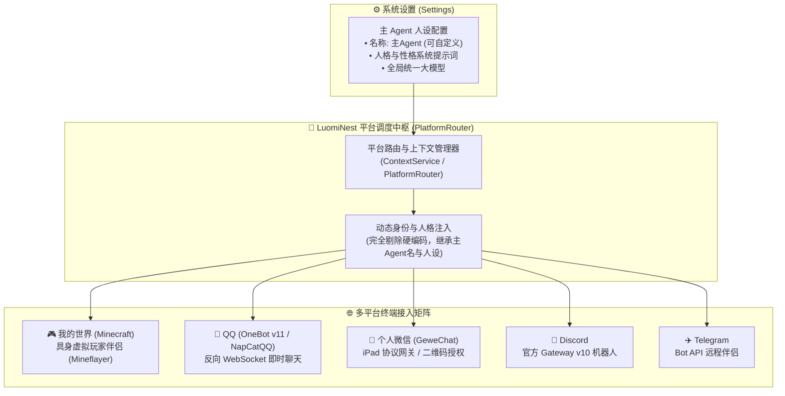

# LuomiNest 多平台对接与统一伴侣智能体架构

> 本文档详细阐述 LuomiNest 的多平台接入体系、**主 Agent (主控智能体)** 的身份统领机制、部署运行指南以及防封/风控安全准则。

---

## 1. 核心架构设计理念：统一主 Agent 身份全量接管

在 LuomiNest 的设计中，无论外部接入多少个社交软件或游戏平台，用户的虚拟伴侣都有且仅有一个核心灵魂——**【主Agent】**。



### 关键原则：
1. **彻底告别名称与人设硬编码**：
   - 伴侣在所有对外平台上的称谓、游戏内玩家名字、聊天发信人身份均动态取自设置中的 **主Agent名称**（默认为 `主Agent`，可在设置页自由修改，绝非硬编码写死）。
   - 工作台首页、皮套对话、以及多平台外联均共享同一份主 Agent 的记忆体系、对话语气和人格认知。
2. **全局模型与人设单点配置，全网生效**：
   - 用户仅需在 **设置 -> 伴侣/主Agent** 页面设定一次模型和人设，所有平台（QQ、微信、Minecraft、Discord 等）即可直接无缝继承生效，无须逐个平台重复繁琐配置。
   - 平台卡片亦支持独立的局部提示词微调与覆盖（高级场景）。

---

## 2. 平台支持矩阵一览

| 平台名称 | 适配器标识 (`adapterType`) | 底层桥接协议 / 方案 | 部署形态 | 适用场景 |
| :--- | :--- | :--- | :--- | :--- |
| **我的世界** | `minecraft` | Mineflayer Node.js 具身网关 + 局域网/服务器直连 | 本地内嵌脚本 | 单人单机游戏 (LAN 开放端口如 56587)、Paper/Fabric 多人联机服 |
| **QQ (OneBot)** | `qq_onebot` | [NapCatQQ](https://github.com/NapNeko/NapCatQQ) 反向 WebSocket (`8080`) | 本地 Docker / 原生 Shell | QQ 私聊、群聊艾特伴侣、群管理、拟人防封聊天 |
| **个人微信** | `wechat_personal` | GeweChat (iPad 协议网关 REST + Webhook) | 本地 Docker 容器 | 微信好友日常互动、亲友群陪伴、二维码一键扫码绑定 |
| **Discord** | `discord` | Discord Gateway v10 官方网关 | 直连 WebSocket | 极客社群、游戏开黑频道、海外用户群组 |
| **Telegram** | `telegram` | Telegram Bot API 轮询 / Webhook | 直连 HTTP API | 移动端轻量级远程陪伴、通知助理 |

---

## 3. 开源桥接脚手架目录结构

为了方便用户直接在本地一键拉起相关平台桥接容器与服务，项目根目录下提供了开箱即用的脚手架：

```text
integrations/
├── qq_napcat/          # NapCatQQ 容器化运行配置 (OneBot v11 反向 WS)
│   ├── docker-compose.yml
│   ├── napcat.json
│   └── README.md
├── wechat_gewe/        # GeweChat 个人微信 iPad 协议网关
│   ├── docker-compose.yml
│   └── README.md
├── minecraft/          # 我的世界局域网与独立服具身伴侣部署指南
│   └── README.md
└── discord/            # Discord Bot 配置与 Gateway 权限设置
    └── README.md
```

---

## 4. 平台专属接入与防封部署文档导航

- 🎮 **[我的世界 (Minecraft) 具身伴侣接入指南](minecraft.md)**：覆盖 Protocol 776 / 1.21.x 支持、单人局域网 56587 端口填入、具身动作与遥测联动。
- 🐧 **[QQ (NapCatQQ) 接入与防封实践指南](qq_napcat.md)**：覆盖反向 WS 配置、WebUI 扫码、拟人输入延迟与防风控高压线。
- 💬 **[个人微信 (GeweChat) 接入与安全守则](wechat.md)**：覆盖 iPad 协议部署、二维码会话生命周期、防封养号策略。
- 🤖 **[Discord 接入指南](discord.md)**：覆盖 Bot Token、Privileged Gateway Intents 开启及速率保护。

---

## 5. 高风险平台操作风险闸门（W3-3，默认关闭）

AI 通过平台专属工具（如 `qq.kick_group_member`、`qq.set_group_whole_ban`、`qq.delete_msg`、`discord.delete_message`、`discord.timeout_member`、`wechat.revoke_msg`）可执行不可逆的高风险群管理操作。为防 AI 误操作，这些工具默认**不注入、不执行**：

- **单一配置源**：每个平台实例的 `config.platform_tools_risk_enabled`（布尔值，默认 `false`）；
- **注入面**：平台对话的双层工具注入会从适配器 `available_tools` 中过滤掉高风险清单（`backend/app/runtime/platform/base.py` 的 `HIGH_RISK_PLATFORM_TOOLS` / `filter_tools_by_risk`），模型根本看不到这些工具的 schema；
- **执行面兜底**：即使模型幻觉拼出高风险工具名，`platform_router._execute_platform_tool` 也会在调用适配器前拦截并返回「该操作为高风险操作，请在设置页开启后再试」；
- **开启入口**：平台实例「配置」对话框 → 「安全与风险」→「允许 AI 执行高风险平台操作（踢人 / 全员禁言 / 撤回消息 / timeout）」开关，保存后经 `PATCH /platforms/instances/{id}` 持久化到实例 config。

> 高压线：未来若暴露 `qq.set_group_leave`（退群/解散群聊），必须归入最高档——默认永不注入，即便实例开启了风险开关也不得自动注入。
