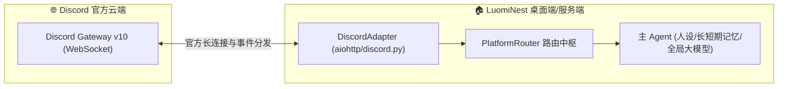

# Discord 官方网关接入指南

LuomiNest 原生支持通过 Discord 官方 Gateway v10 协议接入。无需安装第三方协议中间件，仅需在 Discord 开发者后台创建 Bot 即可将 **【主Agent】** 派驻到你的 Discord 服务器或频道中。

---

## 1. 架构总览

---

## 2. 详细配置流程

### 第一步：在 Discord Developer Portal 创建机器人

1. 登录 [Discord Developer Portal](https://discord.com/developers/applications)。
2. 点击右上角的 **New Application** 按钮，为你的应用命名（例如填入你的主 Agent 名字）。
3. 在左侧菜单栏点击 **Bot**：
   - 点击 **Reset Token**，复制生成的 `Bot Token` 并妥善保存。
   - **关键设置（Privileged Gateway Intents）**：向下滚动到特权意图区域，必须勾选开启以下三项：
     -  **Presence Intent**
     -  **Server Members Intent**
     -  **Message Content Intent**（若未勾选此项，机器人将无法读取消息内容）。
   - 点击底部的 **Save Changes**。
4. 生成机器人邀请链接：
   - 点击左侧菜单中的 **OAuth2 -> URL Generator**。
   - 在 **Scopes** 中勾选 `bot`。
   - 在下方出现的 **Bot Permissions** 中勾选：
     - `Send Messages`
     - `Read Messages/View Channels`
     - `Read Message History`
     - `Embed Links`
     - `Attach Files`
   - 复制页面最下方生成的 URL，粘贴到浏览器中，选择你要邀请入驻的 Discord 服务器并完成授权。

---

### 第二步：在 LuomiNest 平台对接中配置

1. 打开 LuomiNest 桌面客户端 -> **工作台 -> 平台对接**。
2. 找到 **Discord** 平台卡片，点击 **设置**（齿轮图标）。
3. 在配置项中填写：
   - **Discord Bot Token (bot_token)**：粘贴第一步获取的 Bot Token。
4. 点击 **保存配置**。
5. 点击该实例的 **启动** 开关。
6. 实例变为绿色“运行中”后，在 Discord 服务器频道中 @ 机器人或在私聊窗口中发送任意消息，主 Agent 即可秒级回复！

---

## 3. 网络代理与风控注意事项

1. **网络连接环境**：
   - Discord 在部分国家和地区需要配置科学上网代理环境。LuomiNest 适配器原生遵循系统网络代理（或环境变量 `HTTP_PROXY`/`HTTPS_PROXY`）。
2. **频率与速率限制 (Rate Limit)**：
   - Discord 官方对单个 Bot 的 API 请求速率限制一般为每秒 50 次。LuomiNest 内部实现了请求缓冲队列与重试退避机制，确保不会触发 429 封禁。
