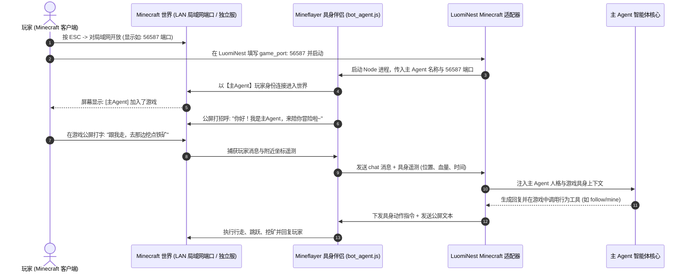

# 我的世界 (Minecraft) 具身伴侣深度接入与联机指南

本文档全面指导如何在 **《我的世界》(Minecraft Java 版)** 中引入 LuomiNest **【主Agent】** 具身伴侣，与玩家实现同服探险、采矿、建造与智能语音/公屏交互。

---

## 1. 架构总览与交互流程



---

## 2. 关键特性与协议自适应

1. **主 Agent 名称与人设动态继承**：
   - 伴侣进入游戏所用的玩家 ID 默认动态读取系统设置中的 **【主Agent名称】**（可在 LuomiNest 设置页随时修改）。
   - 游戏内的行为决策与聊天口吻完全继承主 Agent 的人设系统提示词，保持角色跨平台一致。
2. **协议全版本支持 (Protocol 776 / 1.21.x & 1.8-1.20)**：
   - 底层集成 Node.js `mineflayer` 引擎，具备强大的协议自动协商能力。
   - 原生版客户端（Vanilla）、纯净启动器客户端、Fabric / Forge / Quilt 模组客户端均可自动握手。
3. **单人单机局域网 (LAN) 端口直连**：
   - 无需租用或额外搭建复杂的多人云服务器，玩家在单人单机存档中点击“对局域网开放”，填入生成的 5 位端口即可瞬间连通。

---

## 3. 单人游戏（对局域网开放）操作步骤

### 第一步：游戏内开启局域网世界

1. 在 Minecraft 客户端中加载或新建一个单人存档世界。
2. 进入游戏后，按下键盘左上角的 `ESC` 键弹出游戏菜单。
3. 点击 **“对局域网开放” (Open to LAN)**。
4. 勾选你需要的游戏模式（如生存模式），然后点击 **“创造一个局域网世界”**。
5. 此时游戏左下角聊天区会出现黄色/白色的系统广播文本，例如：
   ```text
   本地游戏已在端口 56587 上开启
   ```
   **请记下这串数字（例如 `56587`）**。每次重新进入游戏时，系统都会随机分配一个新的 5 位端口。

### 第二步：在 LuomiNest 桌面客户端中配置

1. 打开 LuomiNest 桌面客户端，导航至 **工作台 -> 平台对接** 页面。
2. 找到 **Minecraft** 适配器卡片，点击右侧的 **设置**（齿轮图标）。
3. 在弹出的配置对话框中，填写以下参数：
   - **局域网/游戏端口 (game_port)**：填入第一步获取的 5 位端口号（例如 `56587`）。
   - **服务器地址 (game_host)**：单机游戏填 `127.0.0.1` 即可。
   - **伴侣玩家名称 (bot_name)**：**推荐留空**。留空时系统将自动继承你在设置页面设定的【主Agent】名称。
   - **自动派遣伴侣入服 (auto_spawn_bot)**：设置为 `true`。
   - **模组通信端口 (ws_port)**：默认 `8081`（用于伴侣进程与主程序内部通信）。
4. 点击 **保存配置** 按钮。

### 第三步：启动伴侣并畅快互动

1. 点击 Minecraft 实例卡片上的 **启动** 开关。
2. 切回 Minecraft 游戏窗口，你会看到：
   - 伴侣角色以你的主 Agent 名称出现在你周围的世界出生点或你身旁。
   - 伴侣在公屏向你发送问候语。
3. 按 `T` 键打开游戏聊天框，输入任何想对伴侣说的话，伴侣即可根据环境与上下文实时回复！

---

## 4. 多人服务器（Paper / Purpur / Fabric 等）接入

如果你有长期运行的自建多人联机服务器：

1. 打开服务端的配置文件 `server.properties`。
2. 将正版验证关闭：
   ```properties
   online-mode=false
   ```
   > 注：由于虚拟伴侣是以离线客户端形式登入，关闭 online-mode 才能使伴侣顺利握手进服。如果服务器使用了登录插件（如 AuthMe），可在配置中为伴侣账号设置自动登录或免验证名单。
3. 在 LuomiNest Minecraft 配置中：
   - `game_host`: 填入你的服务器 IP 或域名。
   - `game_port`: 填入服务器端口（默认 `25565`）。
4. 保存并点击启动，伴侣即会长驻在服务器中陪伴所有在服玩家！

---

## 5. 常见问题排查 (Troubleshooting)

### Q1: 提示 `ECONNREFUSED 127.0.0.1:xxxxx` 无法连接？
- **原因**：填写的端口与当前实际开放的局域网端口不符，或者单机世界尚未开启局域网。
- **排查**：在游戏中重新查看左下角的局域网端口提示，并更新到 LuomiNest 的 `game_port` 配置中。

### Q2: 提示 `Spawn bot error: node is not recognized`？
- **原因**：本地操作系统环境变量中未找到 `node` 命令。
- **解决**：前往 [Node.js 官方网站](https://nodejs.org) 下载并安装 Node.js LTS 版本（推荐 v18 或 v20），安装后重启 LuomiNest 即可。

### Q3: 伴侣名字在部分旧版本提示非法字符？
- **原因**：极少数老版本 Minecraft 服务端不支持非英文字符的玩家名。
- **解决**：在实例配置的 `bot_name` 中填入合法的英文字符（例如 `Lumi_Companion`）。即使玩家名是英文，其聊天输出、性格与提示词依然 100% 保持主 Agent 人设！
