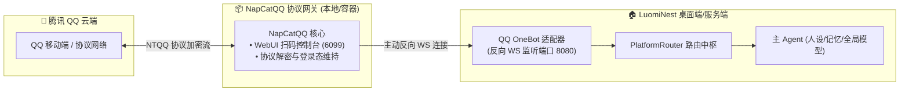

# QQ (OneBot v11 / NapCatQQ) 接入与防封实战指南

本文档介绍如何通过开源新一代无头架构 **NapCatQQ** 将腾讯 QQ 接入 LuomiNest，使 **【主Agent】** 成为你的 QQ 私聊与群聊专属智能体伴侣。

---

## 1. 架构原理：反向 WebSocket 极速穿透

NapCatQQ 作为一个独立的 QQ 协议底层服务，采用 **反向 WebSocket (Reverse WS)** 模式主动连接 LuomiNest：



### 反向 WS 的巨大优势：
- **无需公网 IP**：无需路由器端口映射，无论家庭局域网还是校园网均可秒级连通。
- **高实时性**：长连接事件流推送，毫秒级捕获私聊与群消息。

---

## 2. 部署与连接详细指南

### 方案 A：使用本地脚手架 Docker Compose（首选推荐）

我们已在代码仓库中内置了现成的编排文件 `integrations/qq_napcat/docker-compose.yml`：

1. **拉起服务**：
   在命令行终端中执行：
   ```bash
   cd integrations/qq_napcat
   docker compose up -d
   ```
2. **网页扫码登录**：
   - 打开浏览器，访问 NapCat WebUI 管理面板：`http://localhost:6099/webui`
   - 使用待作为机器人的 QQ 手机端扫描屏幕上的二维码。
   - 手机上点击“确认登录”。
   - 登录成功后，NapCat 会将设备密钥和登录态缓存至 `./data` 和 `./config` 目录中，下次启动无需再次扫码。
3. **在 LuomiNest 平台对接配置**：
   - 打开 LuomiNest 桌面客户端 -> **工作台 -> 平台对接**。
   - 找到 **QQ OneBot** 卡片，点击 **设置**（齿轮图标）。
   - 确认反向 WS 端口为 `8080`（若配置了通信密钥 `access_token`，确保两端一致）。
   - 保存并点击启动开关。
   - 状态显示为绿色“运行中”即表示对接大功告成！

---

### 方案 B：Windows 本地原生绿色版 (免 Docker)

如果本地未安装 Docker：
1. 访问 [NapCatQQ Releases 页面](https://github.com/NapNeko/NapCatQQ/releases)，下载最新版的 `NapCat.Shell.zip`。
2. 解压至本地任意目录（例如 `D:\NapCat`）。
3. 双击运行 `napcat.bat`，根据终端控制台指示扫码登录。
4. 在生成的 `config/onebot11_<你的QQ号>.json` 中修改如下部分：
   ```json
   "reverseWs": {
     "enable": true,
     "urls": [
       "ws://127.0.0.1:8080/ws/qq"
     ]
   }
   ```
5. 重启 `napcat.bat` 即可连接入 LuomiNest。

---

## 3. 防封号与官方风控实战守则 (Anti-Ban Guard)

腾讯近年来针对 QQ 自动化机器人部署了基于深度学习的风控与行为检测系统（主要检测：非官方客户端指纹、异常发言频率、敏感内容与群发行为）。

为确保你的机器人账号长久稳定运行，**请务必严格遵守以下防封规范**：

### 1. 账号底蕴与养号规范 (最关键的生命线)
- ❌ **绝对不要使用刚注册的新账号（白号）**：注册不满 30 天或缺乏历史社交记录的新账号在非官方登录环境下极高概率直接被临时冻结。
-  **推荐账号标准**：
  - 注册时间大于 6 个月。
  - 已完成实名认证并绑定手机号。
  - 账号有正常的人工聊天历史、空间动态与好友关系链。

### 2. IP 与网络环境同源性
-  **同源家庭网络**：确保 NapCatQQ 运行所在的电脑与你日常用手机登录该 QQ 时处于**相同的家庭宽带 WiFi 或本地局域网内**。
- ❌ **严禁机房数据中心公网 IP**：避免直接将 NapCatQQ 架设在阿里云、腾讯云等公网云服务器上。腾讯对数据中心 IP 段有强风控标记。

### 3. 拟人停顿与频率控制 (LuomiNest 已内置保护)
-  **模拟人类输入状态**：LuomiNest 的 `LuomiNestQQAdapter` 内部已实现拟人防封保护：
  - 在回复前会向 QQ 触发发送“对方正在输入中”的动作包。
  - 根据回复文本的长度，自动注入 1.5 ~ 3.5 秒的随机自然拟人延迟，彻底避免“机器秒回”指纹特征。
-  **频次控制**：
  - 尽量限制每分钟单聊回复不超过 10 条。
  - 在群聊中建议配置为**仅艾特 (@) 或回复机器人时才触发作答**，严禁对群内所有人的每一句话都无脑秒回刷屏。

### 4. 行为红线与敏感词隔离
- ❌ 严禁让机器人群发任何外链、营销广告、或者带“进群/领福利”等导流文本。
- ❌ 严禁在短时间内被频繁拉入几十个互不相识的大型陌生人社群。
-  遇到涉政、违规或高风险提问时，LuomiNest 的内容审查过滤器会自动优雅拒答，避免触碰云端审查红线。
