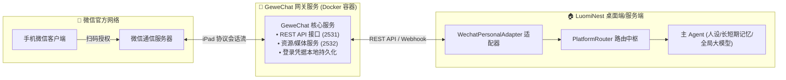

# 个人微信 (GeweChat / iPad 协议) 接入与防封指南

微信是日常最常用的即时通讯工具。LuomiNest 通过开源 **GeweChat**（基于 iPad 协议的原生微信网关）实现与个人微信号的双向直连，让 **【主Agent】** 随时陪伴在你的微信列表中。

---

## 1. 架构总览与工作原理



---

## 2. 部署与接入步骤

### 第一步：启动 GeweChat 本地网关

使用仓库中已提供的编排文件 `integrations/wechat_gewe/docker-compose.yml`：

```bash
cd integrations/wechat_gewe
docker compose up -d
```
启动完成后，GeweChat 服务将在本机的 `http://127.0.0.1:2531` 端口就绪。

### 第二步：在 LuomiNest 中配置并扫码登录

1. 打开 LuomiNest 桌面客户端 -> **工作台 -> 平台对接**。
2. 找到 **个人微信 (GeweChat)** 实例卡片，点击 **设置**（齿轮图标）。
3. 填写配置项：
   - **GeweChat API 地址 (api_url)**：填入 `http://127.0.0.1:2531/v2/api`
   - **API Token (token)**：首次使用可留空，系统启动时会自动向网关申请分配新设备的 Token 并保存。
4. 保存配置后，点击 **启动** 开关。
5. 系统会自动请求获取登录二维码：
   - 客户端弹窗或通知会展示微信 iPad 协议登录二维码。
   - 使用待作为机器人的微信手机端扫描该二维码。
   - 手机端勾选“允许登录 iPad 微信”。
6. 授权完成后，实例状态转为绿色“运行中”，你的微信号即成功化身为主 Agent 伴侣！

---

## 3. 微信防封与极高危风控规避准则 (WeChat Anti-Ban Protocol)

> [!CAUTION]
> 微信对第三方协议客户端的风控强度显著高于其他社交软件。请务必逐字阅读并严格执行以下安全规范：

### 1. 账号资质红线（绝不破例）
- ❌ **严禁使用注册不满 6 个月的新微信号**！新注册微信号未沉淀可信度模型，一旦以非原生设备上线，极易触发保护性限制或封禁 7 天。
-  **合格账号画像**：
  - 注册时间大于 6 个月（最好一年以上常用号或深度使用过的老号）。
  - 已绑定实名银行卡、手机号。
  - 微信账号有日常正常的朋友圈、好友群聊历史互动记录。

### 2. 网络同源性原则
-  **必须与手机同处于家庭 WiFi / 宽带局域网**：
  - 在首次扫码登录时，手机和运行 Docker 的电脑必须连在同一个家庭 WiFi 下。
  - 严禁挂载国外公共代理或公网机房云服务器 IP（会被直接标记为异地异常盗号行为）。

### 3. 使用场景严格限定（个人陪伴 vs 违规营销）
-  **安全定位**：个人私人助理、好友日常问答、家庭/情侣专属亲友群互动。
- ❌ **严禁高危行为**：
  - 严禁短时间内批量自动同意好友申请。
  - 严禁向陌生人或社群批量群发广告外链或带有商业推广性质的敏感营销词。
  - 严禁让伴侣接管几十个甚至上百个大型陌生人社群。

### 4. 会话与 Token 持久化保护
- 确保 `integrations/wechat_gewe/data` 挂载目录有正确的读写权限，保持本地登录态缓存不丢失，避免每次容器重启都触发重新扫码。
